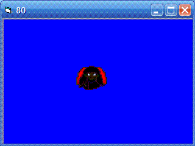



## Direct3D 2D Sprites

### Description

This is a piece of code done in Directx8 with Direct3D.What it does is make a window and a 2D sprite.You can move it around with the arrow keys.If you have been looking for a good windowed 2D program that uses Direct3D, This is for you.EDIT:Changed zip file so it includes the correct Sprite file
 
### More Info
 

             |
---                |---
**Submitted On**   |2005-05-11 08:24:50
**By**             |[Ryan Houdek](https://github.com/Planet-Source-Code/PSCIndex/blob/master/ByAuthor/ryan-houdek.md)
**Level**          |Intermediate
**User Rating**    |5.0 (10 globes from 2 users)
**Compatibility**  |VB 6\.0
**Category**       |[Graphics](https://github.com/Planet-Source-Code/PSCIndex/blob/master/ByCategory/graphics__1-46.md)
**World**          |[Visual Basic](https://github.com/Planet-Source-Code/PSCIndex/blob/master/ByWorld/visual-basic.md)
**Archive File**   |[Direct3D\_21888175142005\.zip](https://github.com/Planet-Source-Code/ryan-houdek-direct3d-2d-sprites__1-60486/archive/master.zip)

